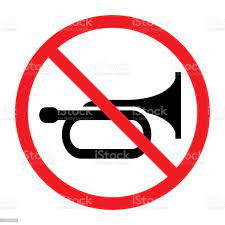

<h1 align="center">

</h1>

---

### kellemetlen rendszerhangok, sípolások kikapcsolása arch rendszeren

| fájl módosítása, létrehozása | ```sudo nano /etc/modprobe.d/nobeep.conf``` |
|  ezeket a sorokat kell beleírni: | ```blacklist pcspkr```<br>```blacklist snd_pcsp``` |

---

[Vissza](../README.md)
