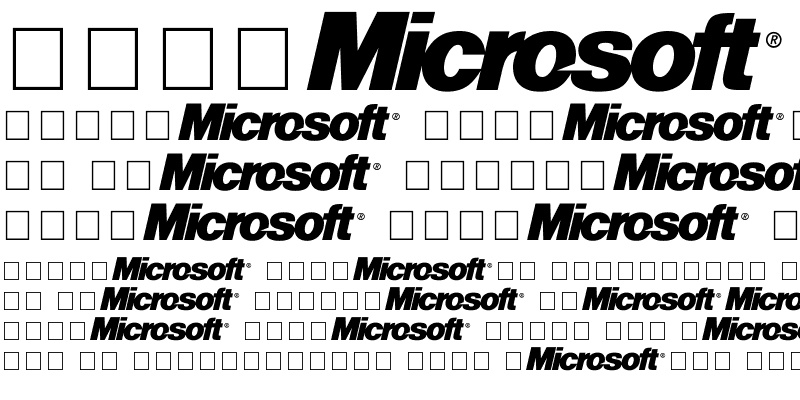

<h1 align="center">

</h1>

---

### dedian rendszereken

```
sudo apt install ttf-mscorefonts-installer
```

---

### arch redszereken

1. csomagok frissítése

```
sudo pacman -Syu
```

> ha rég volt frissítve a rendszer, akkor szükség lehet egy teljes adatbázis letőltésre

```
sudo pacman -Syyu
```

2. AUR engedélyezése

```
sudo sed -Ei '/EnableAUR/s/^#//' /etc/pamac.conf
```

3. microsoft betűtípusok telepítése

```
pamac build ttf-ms-fonts
```

---

[Vissza](../README.md)
