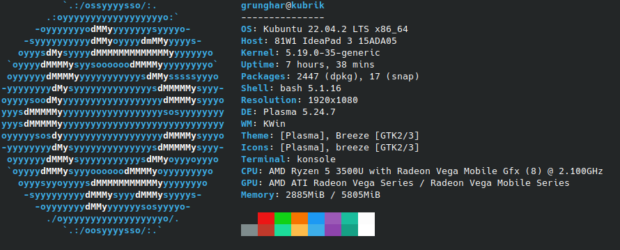
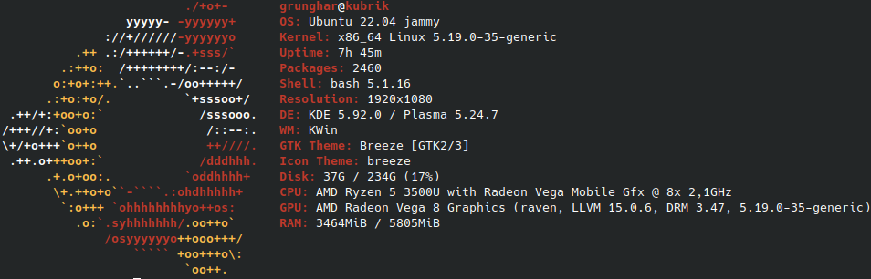

<h1 align="center">

</h1>

---

> neofetch telepítése debian rendszereken:

```
sudo apt install neofetch
```

> neofetch telepítése arch rendszereken:

```
sudo pacman -S neofetch
```

> automatikus indítás beállítása:

```
sudo su
```

```
echo neofetch >> /etc/bash.bashrc
```

> vagy (pl. manjaro-nál)

```
echo neofetch >> ~/.zshrc
```

---

<h2 align="center">

</h2>

---

> screenfetch telepítése debian rendszereken:

```
sudo apt install screenfetch
```

> screenfetch telepítése arch rendszereken:

```
sudo pacman -S screenfetch
```

> automatikus indítás beállítása:

```
sudo su
```

```
echo screenfetch >> /etc/bash.bashrc
```

> vagy (pl. manjaro-nál)

```
echo screenfetch >> ~/.zshrc
```

---

[Vissza](../README.md)
