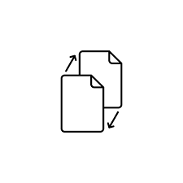

<h1 align="center">

</h1>

---

# Swapfile

### ext4

> 1GB swapfile létrehozása: ```sudo fallocate -l 1G /swap.img```

> jogosultságok beállítása: ```sudo chmod 600 /swap.img```

> swapfile formázása: ```sudo mkswap /swap.img```

> swapfile használatának engedélyezése: ```sudo swapon /swap.img```

> swapfile felvétele az fstab-ba: ```sudo nano /etc/fstab```
   > beírni a következőket a fájl végére: ```/swap.img	swap	swap	defaults	0	0```

> swapfile ellenőrzése: ```sudo swapon --show```

|     | btrfs |
| :-- | :---- |
| belépés root-ként | sudo su |
| subvolume létrhozása swap néven | btrfs subvolume create /swap |
| 4GB-os swapfile létrehozása | btrfs filesystem mkswapfile --size 4g --uuid clear /swap/swapfile |
| swapfile használatának engedélyezése | swapon /swap/swapfile |
| swapfile felvétele az fstab-ba | sudo nano /etc/fstab |
|  beírni a következőket a fájl végére: | /swap/swapfile	swap	swap	defaults	0	0 |

---

### swappiness érték beállítása

> A swappiness egy kernel, mely meghatározza, hogy a rendszer milyen gyakran használja a csereterületet. Paraméter 0 és 100 között lehet. A 0-hoz közeli érték eredménye a swap terület használatának elkerülése, míg a magasabb érték ennek ellenkezője. Alapértelmezett beállítás: 60

| Leírás | Parancs |
| :----- | :------ |
| swappiness érték megtekintése | cat /proc/sys/vm/swappiness |
| érték átállítása | sudo sysctl vm.swappiness=30 |
| hogy az érték újraindítás után is megmaradjon | sudo nano /etc/sysctl.conf |
|  hozzáfűzni a fájlhoz: | vm.swappiness=30 |

> Érdemes apró lépésenként csökkenteni vagy növelni az értéket az optimális érték megtalálásához.

---

### Swap fájl törlése

| Leírás | Parancs |
| :----- | :------ |
| swapfile deaktiválása | sudo swapoff -v /swap.img |
| törlés az fstab-ból | sudo nano /etc/fstab |
|  ezt a sort kell törölni: | /swap.img	swap	swap	defaults	0	0 |
| swapfile törlése | sudo rm -f /swap.img |

---

[Vissza](../README.md)
